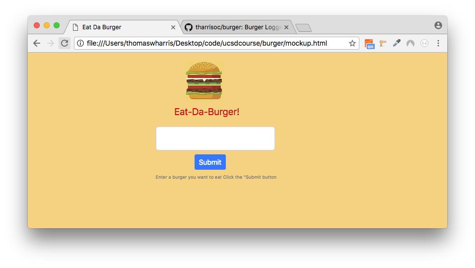

# burger
Burger Logger using MySQL, Node, Express and Handlebars

The following bugs are showstoppers, despite their simplicity.

I am able to load neither the image of the burger, nor the css style sheet when running the script using node. I have tried every variant of the paths to these items that I can think of, but have not been able to find the correct combination of path elements from node's perspective.

The path below was copied directly from the `index.handlebars` file, and as you can see, the copy of the image as stored in this repository is found at that location.

``

The message I see when running the script in node is:
`GET http://localhost:3000/public/assets/img/burgersmall.jpg 404 (Not Found)`

I have a similar, but slightly different problem with the style sheet.

My declaration is:
`<link rel="stylesheet" type="text/css" href="public/assets/css/burger_style.css">`

<link rel="stylesheet" type="text/css" href="public/assets/css/burger_style.css">

[Note: in my markdown editor, the background color that is assigned in that file is applied to this README, again showing that the path is correct.]

The error message I am seeing for this case is:

`Refused to apply style from 'http://localhost:3000/public/assets/css/burger_style.css'
because its MIME type ('text/html') is not a supported stylesheet MIME type
and strict MIME checking is enabled.`

As a side note, the following is a mockup of the top portion of the page that I am trying to display.

On the real page, the two lists of unconsumed and consumed burgers would also be displayed.

### Update 1

I finally realized that the problem is not on the server side -- the problem is that the browser is not successfully downloading the image and the stylesheet.

The Network panel in Chrome shows the following errors:

for CSS, it shows that  

    bootstrap.min.css  is downloaded successfully [200 OK, stylesheet]    
    burger_style.css /public/assets/css fails [Status (canceled) stylesheet]

for Img, it shows  

    burgersmall.jpg /public/assets/img fails [Status 404 Not Found text/html]

The following excerpt at  

  <https://developer.mozilla.org/en-US/docs/Learn/JavaScript/Client-side_web_APIs/Fetching_data>

*may* describe what is happening:

>Some browsers (including Chrome) will not run XHR requests if you just run the example from a local file. This is because of security restrictions.

### Update 2

On Heroku, the JawsDB add-on was deployed per the instructional video and MSQLHerokuDeploymentProcess.pdf. 

The burgers_db database and burgers table were created, and the table was seeded using the MySQL command line monitor.

The app itself was then deployed to Heroku.

When the app was run on Heroku, it crashed (Application error. "An error occured in the application and your page could not be served.") The details can be found in HerokuDeployentNotes.txt.

When tha app was run locally using the `heroku local web` command, it behaved in exactly the same way as it does when it is run on the Mac (i.e. burgersmall.jpg and burger_style.css were not retrieved.)

### Update 3

The Application error mentioned in Update 2 has been fixed. The script no longer crashes on startup, and is able to retrieve rows from the burgers table. However, the problem regarding the image and css files persists.

### Update 4

Insertion of newly-purchased, unconsumed burgers into the `burgers` table when the Submit button is clicked is now working.

### ToDo

* Investigate and fix the inability of the browser to load assets.
* The current code redisplays the entire page whenever a new burger is added to the database. Refactor the code so that AJAX is used for both ADD and UPDATE queries.

